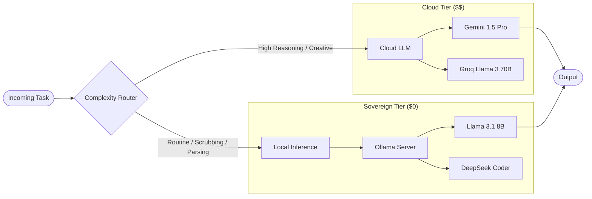
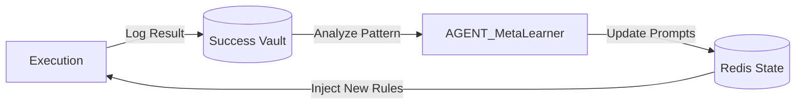
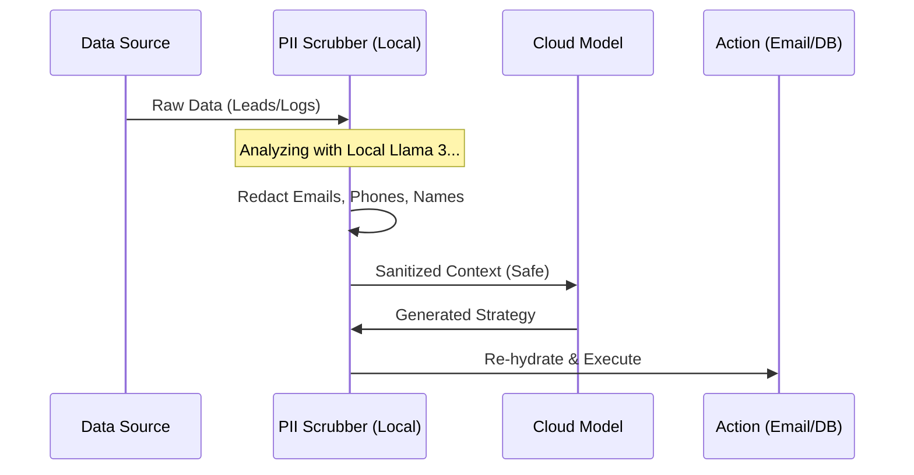

# CASE STUDY: THE DUDE - Autonomous Commercial Engine
## Engineering of Results 2026: A Sovereign AI Workforce

**Role:** Lead Architect & Developer
**Status:** Proprietary Software (In Production)
**Architecture Type:** Multi-Agent Orchestration with Hybrid Inference

---

## 1. Executive Summary

"The Dude" is not a chatbot; it is a **Synthetic Workforce**. It is an autonomous ecosystem of specialized AI agents designed to execute the complete commercial lifecycle—from lead generation to sales closing—without human intervention.

Unlike traditional SaaS wrappers, The Dude operates on a **Sovereign Infrastructure**, prioritizing data privacy and zero-marginal-cost operation through local inference.

### Key Architectural Pillars
1.  **Multi-Agent Orchestration**: 9 specialized agents (Intel, Sales, Ops, Sentinel) communicating via an event bus.
2.  **Hybrid Inference Engine**: Dynamic routing between Local LLMs (Ollama) for routine tasks and Cloud Models (Gemini/Groq) for high-reasoning tasks.
3.  **Model Context Protocol (MCP)**: Standardized bridge between LLMs and local/remote data sources.
4.  **Recursive Self-Improvement**: A "Meta-Learning" engine inspired by Jürgen Schmidhuber's principles that optimizes agent instructions based on past failures.

---

## 2. System Architecture (The "Black Box")

The system follows a **Cluster-based Architecture**, separating concerns into Strategy, Execution, and Guardrails.

### High-Level Data Flow

```mermaid
graph TD
    User([User / Trigger]) -->|Mission Request| CEO[Orchestrator (CEO)]
    
    subgraph "Cluster 1: Intelligence"
        CEO -->|Request Context| INTEL[AGENT_INTEL]
        INTEL -->|Deep Search| WEB((Web / APIs))
        INTEL -->|Retrieve Patterns| MEM[(Vector Memory)]
    end
    
    subgraph "Cluster 2: Execution"
        CEO -->|Delegate Task| SALES[AGENT_SALES]
        CEO -->|Deploy Infra| OPS[AGENT_OPS]
        SALES -->|Outreach| EMAIL((Email / LinkedIn))
    end
    
    subgraph "Cluster 3: Guardrails"
        SALES -.->|Audit Content| SENTINEL[AGENT_SENTINEL]
        OPS -.->|Security Scan| SECURITY[AGENT_SECURITY]
        SENTINEL --|Approved| SALES
        SENTINEL --|Rejected| FIXER[Self-Correction]
        FIXER --> SALES
    end

    style CEO fill:#f96,stroke:#333,stroke-width:2px
    style MEM fill:#66f,stroke:#333,stroke-width:2px
    style SENTINEL fill:#f66,stroke:#333,stroke-width:2px
```

---

## 3. The "Zero-Cost" Hybrid Inference Engine

To achieve a sustainable business model, the architecture implements an **Asymmetric Inference Strategy**. This routing logic reduces operational API costs by ~90% compared to cloud-only solutions.



**Architectural Decision Record (ADR):**
*   **Context:** Routine tasks (PII scrubbing, JSON formatting, simple emails) consume 80% of token volume.
*   **Decision:** Route all low-complexity tasks to a local Dockerized Ollama instance.
*   **Result:** Reduced daily operational cost from ~$5.00 to ~$0.05.

---

## 4. The Cognitive Engine: Recursive Self-Improvement

Beyond standard automation, The Dude implements a **Meta-Learning Loop** based on *Schmidhuber’s "Learning to Learn"* principles. The system does not just execute; it improves its own architecture over time.

### The "Schmidhuber" Loop
1.  **Experience Replay**: Every task execution (Success/Failure) is compressed into a vector embedding.
2.  **Backpropagation of Error**: When an agent fails (e.g., `AGENT_SALES` gets a bounce), the `AGENT_MetaLearner` analyzes the root cause.
3.  **Weight Adjustment**: The system dynamically updates the "System Prompt" (Weights) of the failing agent in Redis, effectively "fine-tuning" the workforce without code changes.



---

## 5. Privacy & Sovereignty Shield

In the era of EU AI Act and GDPR, "The Dude" implements a **Privacy-First Middleware** that sanitizes data *before* it leaves the controlled environment.



---

## 6. Technical Stack

*   **Orchestration:** Python (LangGraph), Node.js (Crypto/Utils).
*   **Persistence:** Supabase (Relational), Redis (Hot State/Vector Cache).
*   **Inference:** Dockerized Ollama (Local), Vertex AI (Cloud).
*   **Integration:** Model Context Protocol (MCP) servers for filesystem, GitHub, and browser access.
*   **Observability:** Custom Streamlit Dashboard for real-time agent monitoring.

---

*This document serves as a public architectural overview of The Dude S.A.S. Proprietary code and specific implementation details are confidential.*