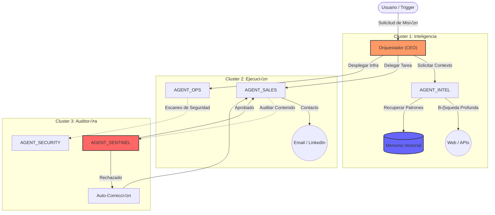
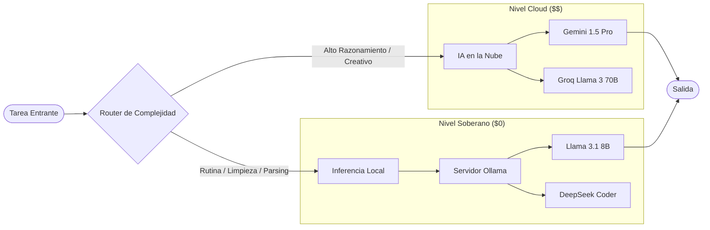
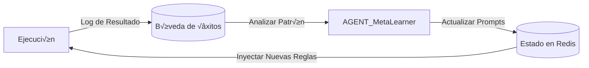
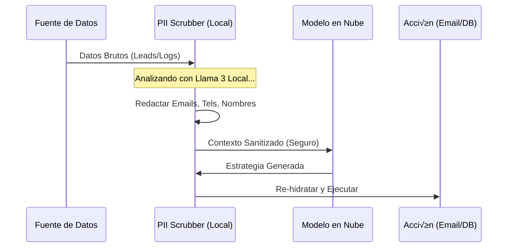

# ESTUDIO DE CASO: THE DUDE - Motor Comercial Autónomo
## Ingeniería de Resultados 2026: Una Fuerza Laboral de IA Soberana

**Rol:** Arquitecto Principal y Desarrollador
**Estado:** Software Propietario (En Producción)
**Tipo de Arquitectura:** Orquestación Multi-Agente con Inferencia Híbrida

---

## 1. Resumen Ejecutivo

"The Dude" no es un chatbot; es una **Fuerza Laboral Sintética**. Es un ecosistema autónomo de agentes de IA especializados diseñados para ejecutar el ciclo de vida comercial completo —desde la generación de leads hasta el cierre de ventas— sin intervención humana.

A diferencia de los wrappers de SaaS tradicionales, The Dude opera sobre una **Infraestructura Soberana**, priorizando la privacidad de los datos y una operación de costo marginal cero a través de inferencia local.

> **Definición Técnica:** La plataforma implementa una arquitectura de **Sistemas Cognitivos Híbridos**. Utilizamos **Redes Neuronales de Inferencia** (LLMs locales/cloud) para el razonamiento, **Modelos de Embeddings** para la memoria semántica vectorial, y algoritmos de **Meta-Learning inspirados en Schmidhuber** (como LSTMs lógicos y optimización de gradientes de error) para que el sistema aprenda y se auto-corrija de forma autónoma.

### Pilares Arquitectónicos Clave
1.  **Orquestación Multi-Agente**: 9 agentes especializados (Intel, Sales, Ops, Sentinel) comunicándose a través de un bus de eventos.
2.  **Motor de Inferencia Híbrido**: Enrutamiento dinámico entre LLMs locales (Ollama) para tareas rutinarias y modelos en la nube (Gemini/Groq) para tareas de alto razonamiento.
3.  **Model Context Protocol (MCP)**: Puente estandarizado entre los LLMs y las fuentes de datos locales/remotas.
4.  **Auto-mejora Recursiva**: Un motor de "Meta-Aprendizaje" inspirado en los principios de Jürgen Schmidhuber que optimiza las instrucciones de los agentes basándose en fallos pasados.

---

## 2. Arquitectura del Sistema (La "Caja Negra")

El sistema sigue una **Arquitectura basada en Clusters**, separando las responsabilidades en Estrategia, Ejecución y Reglas de Control.

### Flujo de Datos de Alto Nivel


```mermaid
graph TD
    User([Usuario / Trigger]) -->|Solicitud de Misión| CEO["Orquestador (CEO)"]
    
    subgraph "Cluster 1: Inteligencia"
        CEO -->|Solicitar Contexto| INTEL[AGENT_INTEL]
        INTEL -->|B√∫squeda Profunda| WEB((Web / APIs))
        INTEL -->|Recuperar Patrones| MEM[(Memoria Vectorial)]
    end
    
    subgraph "Cluster 2: Ejecución"
        CEO -->|Delegar Tarea| SALES[AGENT_SALES]
        CEO -->|Desplegar Infra| OPS[AGENT_OPS]
        SALES -->|Contacto| EMAIL((Email / LinkedIn))
    end
    
    subgraph "Cluster 3: Auditoría"
        SALES -.->|Auditar Contenido| SENTINEL[AGENT_SENTINEL]
        OPS -.->|Escaneo de Seguridad| SECURITY[AGENT_SECURITY]
        SENTINEL -->|Aprobado| SALES
        SENTINEL -->|Rechazado| FIXER["Auto-Corrección"]
        FIXER --> SALES
    end

    style CEO fill:#f96,stroke:#333,stroke-width:2px
    style MEM fill:#66f,stroke:#333,stroke-width:2px
    style SENTINEL fill:#f66,stroke:#333,stroke-width:2px
```

---

## 3. El Motor de Inferencia Híbrido de "Costo Cero"

Para lograr un modelo de negocio sostenible, la arquitectura implementa una **Estrategia de Inferencia Asimétrica**. Esta lógica de ruteo reduce los costos operativos de API en un ~90% comparado con soluciones exclusivas en la nube.


```mermaid
flowchart LR
    Task([Tarea Entrante]) --> Router{Router de Complejidad}
    
    Router -- "Alto Razonamiento / Creativo" --> Cloud[IA en la Nube]
    subgraph "Nivel Cloud ($$)"
        Cloud --> Gemini[Gemini 1.5 Pro]
        Cloud --> Groq[Groq Llama 3 70B]
    end
    
    Router -- "Rutina / Limpieza / Parsing" --> Local[Inferencia Local]
    subgraph "Nivel Soberano ($0)"
        Local --> Ollama[Servidor Ollama]
        Ollama --> Llama3["Llama 3.1 8B"]
        Ollama --> DeepSeek["DeepSeek Coder"]
    end
    
    Gemini --> Result([Salida])
    Llama3 --> Result
```

**Registro de Decisión Arquitectónica (ADR):**
*   **Contexto:** Las tareas rutinarias (limpieza de PII, formateo JSON, correos simples) consumen el 80% del volumen de tokens.
*   **Decisión:** Enrutar todas las tareas de baja complejidad a una instancia local de Ollama en Docker.
*   **Resultado:** Reducción del costo operativo diario de ~$5.00 a ~$0.05.

---

## 4. El Motor Cognitivo: Mejora Recursiva Autónoma

Más allá de la automatización estándar, The Dude implementa un **Bucle de Meta-Aprendizaje** basado en los principios de *"Aprender a Aprender"* de Schmidhuber. El sistema no solo ejecuta; mejora su propia arquitectura con el tiempo.

### El Bucle "Schmidhuber"
1.  **Experience Replay**: Cada ejecución de tarea (Éxito/Fallo) se comprime en un embedding vectorial.
2.  **Backpropagation de Error**: Cuando un agente falla (ej. un rebote de correo en `AGENT_SALES`), el `AGENT_MetaLearner` analiza la causa raíz.
3.  **Ajuste de Pesos**: El sistema actualiza dinámicamente el "System Prompt" (Pesos) del agente que falló en Redis, realizando efectivamente un "fine-tuning" de la fuerza laboral sin cambios de código.


```mermaid
graph LR
    Exec[Ejecución] -->|Log de Resultado| Memory[(Bóveda de Éxitos)]
    Memory -->|Analizar Patrón| Meta[AGENT_MetaLearner]
    Meta -->|Actualizar Prompts| Redis[(Estado en Redis)]
    Redis -->|Inyectar Nuevas Reglas| Exec
```

---

## 5. Escudo de Privacidad y Soberanía

En la era del AI Act de la UE y el GDPR, "The Dude" implementa un **Middleware de Privacidad** que sanitiza los datos *antes* de que salgan del entorno controlado.


```mermaid
sequenceDiagram
    participant Source as Fuente de Datos
    participant Shield as PII Scrubber (Local)
    participant Cloud as Modelo en Nube
    participant Dest as Acción (Email/DB)

    Source->>Shield: Datos Brutos (Leads/Logs)
    Note over Shield: Analizando con Llama 3 Local...
    Shield->>Shield: Redactar Emails, Tels, Nombres
    Shield->>Cloud: Contexto Sanitizado (Seguro)
    Cloud->>Shield: Estrategia Generada
    Shield->>Dest: Re-hidratar y Ejecutar
```

---

## 6. Stack Tecnológico

*   **Orquestación:** Python (LangGraph), Node.js (Crypto/Utils).
*   **Persistencia:** Supabase (Relacional), Redis (Estado en caliente / Caché Vectorial).
*   **Inferencia:** Ollama en Docker (Local), Vertex AI (Cloud).
*   **Integración:** Servidores Model Context Protocol (MCP) para sistema de archivos, GitHub y acceso a navegador.
*   **Observabilidad:** Dashboard personalizado en Streamlit para monitoreo de agentes en tiempo real.

---

*Este documento sirve como una visión general arquitectónica pública de The Dude S.A.S. El código propietario y los detalles específicos de implementación son confidenciales.*

---

## 7. Validación del Sistema en Vivo

El siguiente registro demuestra la ejecución en tiempo real del **Motor de Meta-Aprendizaje Schmidhuber**. El sistema realiza con éxito la lógica de compuertas neuronales (LSTM), genera embeddings soberanos y ejecuta la auto-corrección autónoma (reescribiendo sus propias reglas basándose en gradientes de error).

```bash
üöÄ STARTING SCHMIDHUBER ARCHITECTURE VERIFICATION
============================================================

üß™ TEST 1: Neural LSTM Engine (Mathematical Validation)
------------------------------------------------------------
   input: Pattern Confidence=0.95, Compression=2.5x
   output: Cell State = 0.9737253008310173
   PASS: Sigmoid gates activated. State updated strictly via math.

üß™ TEST 2: Vector Store (Ollama Connectivity)
------------------------------------------------------------
   action: Requesting embedding for 'The Dude Architecture'...
   PASS: Ollama is reachable. Embedding is REAL.
   Vector Dim: 768 (First 3: [-0.03642286  0.53184462 -4.27076054])

üß™ TEST 3: Meta-Learning Optimizer (Self-Rewriting Code)
------------------------------------------------------------
   setup: Created dummy agent at agents/TEST_AGENT
   action: Triggering Backpropagation for 'Error: Token limit exceeded'...
🧠 Optimizing TEST_AGENT based on failure data...
   üìâ Gradient calculated: The token limit exceeded error...
   üìù Injecting rule: 'ContextLimitCheck: Check the context size...' into CORE MANDATES
‚úÖ Optimization Applied. System weights updated.
   PASS: Agent instructions were rewritten by AI.

============================================================
LSTM ENGINE: ONLINE
VECTOR STORE: ONLINE
META-LEARNER: ONLINE
============================================================
```